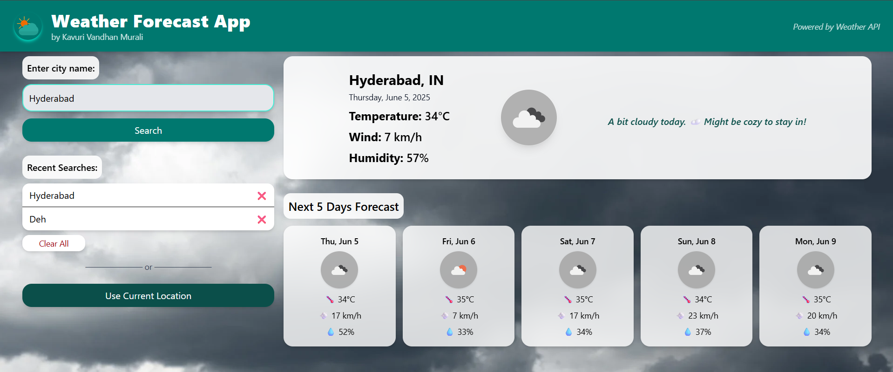
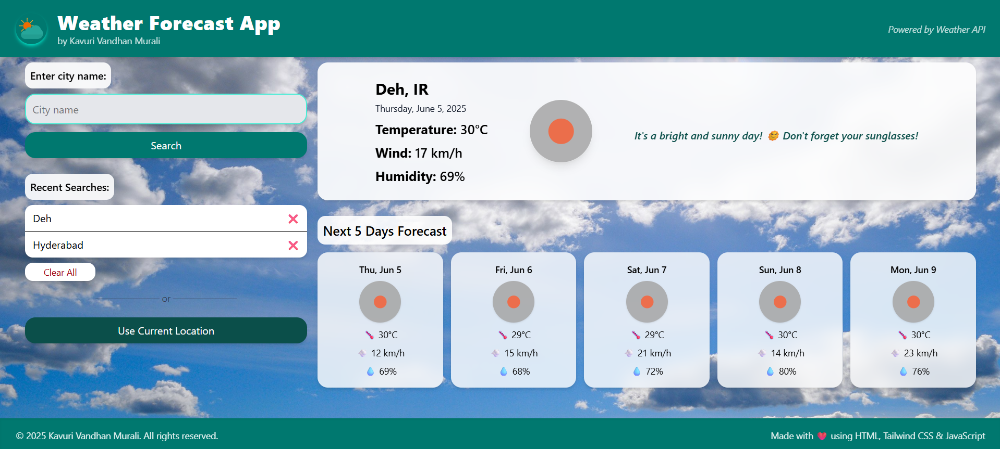
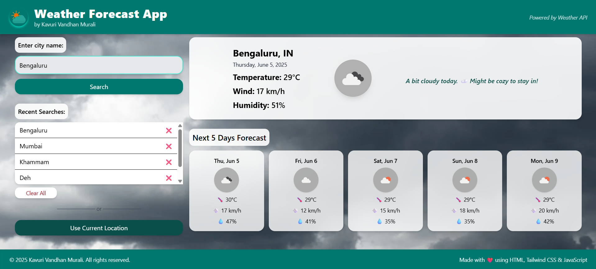
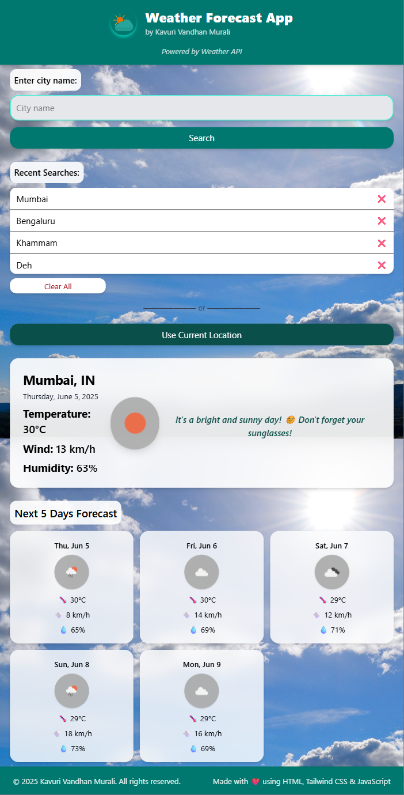

# Weather Forecast Application

A responsive weather forecast web application built using **HTML**, **JavaScript**, and **Tailwind CSS**. It retrieves real-time weather data from a public API and displays current weather conditions, location-based forecasts, and extended outlooks in an intuitive and user-friendly interface.

---

## Features

- **Search by City Name:** Users can enter any city to get current weather and forecast.
- **Real-Time Weather Data:** Fetches up-to-date weather data from the Weather API.
- **Current Location Support:** Detects and displays weather based on user's geolocation.
- **5-Day Weather Forecast:** Shows detailed forecast for the next 5 days with easy-to-read cards.
- **Recent Searches:** Stores and displays recent search history for quick access.
- **Responsive Design:** Works smoothly on desktop, tablet, and mobile devices using Tailwind CSS.
- **Dynamic Weather Icons:** Displays weather icons corresponding to the conditions.

---

## Technologies Used

- **HTML5** — Semantic markup for structure.
- **JavaScript (ES6+)** — API calls, DOM manipulation, user interaction.
- **Tailwind CSS** — Utility-first CSS framework for styling and responsiveness.
- **Weather API** — Real-time weather data source.

---

## Working visuals

## Contact

📧 Email: [vandhanchowdhary@gmail.com]  
🔗 [LinkedIn](https://www.linkedin.com/in/kavurivandhanmurali/) | [GitHub](https://github.com/vandhanchowdhary)

## License

NO LICENSE
This project is not licensed under any specific license. Feel free to use the code for personal projects or educational purposes, but please do not distribute it without permission.
